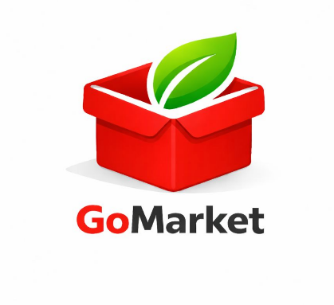

# FECAP - Fundação de Comércio Álvares Penteado

# GoMarket

## Integrantes: <a href="https://www.linkedin.com/in/luis-felipe-trindade25/">Luis Felipe Trindade</a>, <a href="https://www.linkedin.com/in/julia-basilio-aa7a17303">Julia Gomes Basílio</a>, <a href="https://www.linkedin.com/in/maria-eduarda-barberino-olo-b26a2a365">Maria Eduarda Barberino Olo</a>, <a href="https://www.linkedin.com/in/fátima-gomes-19950338a">Fátima Eduarda Gomes Balbino</a>

## Professores Orientadores: <a href="https://www.linkedin.com/in/eduardo-savino/">Eduardo Savino Gomes</a>, <a href="https://www.linkedin.com/in/ronaldo-araujo-pinto-3542811a/">Ronaldo Araujo Pinto</a>, <a href="https://www.linkedin.com/in/francisco-escobar/">Francisco Escobar</a>, <a href="https://www.linkedin.com/in/adriano-valente/">Adriano Valente</a>, <a href="https://www.linkedin.com/in/jbuesso/">José Carlos Buesso Junior</a>

## Descrição

 
<strong>GoMarket</strong> - Marketplace B2B

O **GoMarket** é uma plataforma web desenvolvida com foco no modelo **B2B (Business to Business)**, com o objetivo de conectar fornecedores e compradores por meio de um sistema de anúncios. A proposta do projeto é criar um ambiente digital onde empresas possam divulgar seus produtos e encontrar parceiros comerciais de forma prática, rápida e organizada.

A plataforma funciona como um **marketplace de anúncios**, permitindo que fornecedores publiquem e gerenciem seus produtos, enquanto compradores podem pesquisar, filtrar e comparar diferentes ofertas disponíveis no mercado. O GoMarket tem como principal objetivo **potencializar vendas, aumentar a visibilidade dos fornecedores e otimizar o processo de negociação**, sem intermediar diretamente as transações comerciais.

## 🛠 Estrutura de pastas

-Raiz 
| 
|-->documentos 
  &emsp;|-->antigos 
  &emsp;|Documentação.docx 
|-->executáveis 
  &emsp;|-->windows 
  &emsp;|-->android 
  &emsp;|-->HTML 
|-->imagens 
|-->src 
  &emsp;|-->Backend 
  &emsp;|-->Frontend 
|readme.md 

## 🛠 Instalação

Não há instalação!
Encontre o index.html na pasta executáveis e execute-o como uma página WEB (através de algum browser).

## 💻 Configuração para Desenvolvimento

ESCREVER

## 🎓 Referências

O desenvolvimento do **GoMarket** foi inspirado em plataformas consolidadas do mercado digital, que utilizam modelos de marketplace e conexão entre usuários:

- **OLX** – Plataforma de anúncios e marketplace C2C/B2B  
- **iFood** – Plataforma digital de conexão entre restaurantes e consumidores  
- **Mercado Livre** – Marketplace com foco em compra e venda de produtos  
- **Alibaba** – Plataforma global de comércio B2B entre fornecedores e compradores  
- **Amazon** – Referência em e-commerce e experiência do usuário  
- **LinkedIn** – Referência em conexão entre usuários e networking profissional  

### 🔧 Referências Técnicas

- https://github.com/iuricode/readme-template  
- https://github.com/gabrieldejesus/readme-model  
- https://chooser-beta.creativecommons.org/  
- https://www.toptal.com/developers/gitignore  
💥 O QUE MELHORA

